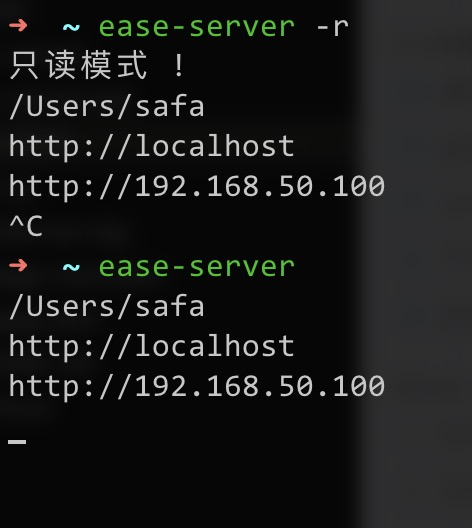
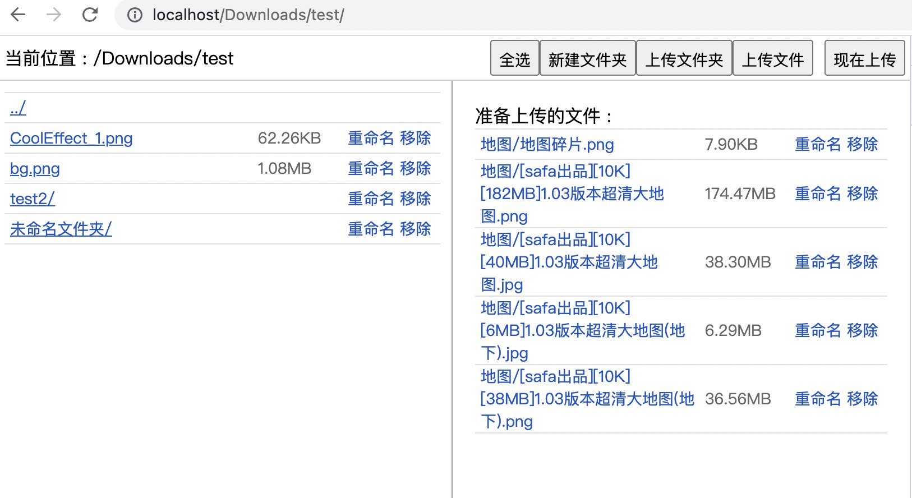

# web-ease-server
简易的web文件服务器




# 安装
```
git clone https://github.com/safagwq/ease-server.git
cd ease-server
yarn
yarn build
```

# 使用之前
您需要使用
```
alias ease-server="~/git/ease-server/ease-server"
```
或者
```
ln -s /Users/safa/git/ease-server/ease-server /usr/local/bin/ease-server
```
等命令将命令设置为全局模式 , 目前暂未提供npm 全局安装方式 .

也可以直接在 ease-server 这个目录里运行 
```
./ease-server -d "目录位置"
```


# 静态服务器
进入任何目录 , ease-server, 会将这个目录视为静态服务器的根目录 , 默认运行3000端口

```
ease-server
```
或者
```
ease-server -p 8080
```
或者
```
ease-server -d ~/Downloads
```
